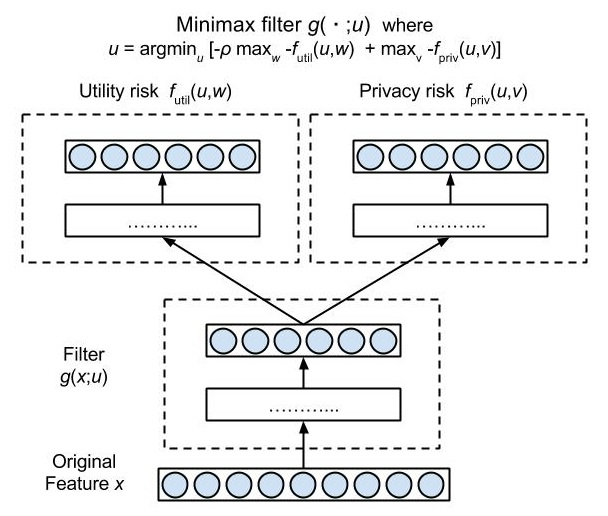

### Minimax Filter
#### is a machine learning approach to preserve privacy against inference attacks
---

#### Summary
The library allows devices (Android, iOS, and python clients) to learn a common classifier/regression model with differential privacy, by solving the distributed ERM problem: min_w f(w) = 1/M sum_{i=1}^M f_i(w), where f_i(w) = 1/n sum_j l(h_w(x_{ij}), y_{ij}).
The library implements private distributed synchronous risk minimization based on [**Hamm'15**], using [Google Firebase](https://firebase.google.com/) as a simple and robust syncrhonization method.  This idea was featured in [Gigaom] (https://gigaom.com/2015/01/22/researchers-show-a-machine-learning-network-for-connected-devices/).

#### Abstract

Preserving privacy of continuous and/or high-dimensional data such as images, videos
and audios, can be challenging with syntactic anonymization methods such as k-anonymity
which are designed for discrete attributes. Differential privacy, which provides a different
and more formal type of privacy, has shown more success in sanitizing continuous data.
However, both syntactic and differential privacy are susceptible to inference attacks, i.e., an
adversary can accurately guess sensitive attributes from insensitive attributes. This paper
proposes a learning approach to finding a minimax filter of raw features which retains infor-
mation for target tasks but removes information from which an adversary can infer sensitive
attributes. Privacy and utility of filtered data are measured by expected risks, and an opti-
mal tradeoff of the two goals is found by a variant of minimax optimization. Generalization
performance of the empirical solution is analyzed and and a new and simple optimization
algorithm is presented. In addition to introducing minimax filter, the paper proposes noisy
minimax filter that combines minimax filter and differentially private noisy mechanism,
and compare resilience to inference attack and differentially privacy both quantitatively
and qualitatively. Experiments with several real-world tasks including facial expression
recognition, speech emotion recognition, and activity recognition from motion, show that
the minimax filter can simultaneously achieve similar or better target task accuracy and
lower inference accuracy, often significantly lower, than previous methods.

### Getting Started
---
#### 1. Download files in /src and /test
The Genki dataset [test/genki.mat](test/genki.mat) ...

#### 2. Run [test/test_NN_genki.py](test/test_NN_genki.py) to test a two-layer sigmoid NN network with softmax output layers on Genki dataset.

Results.
Pre-training by autoencoder
A few minutes,
After 50 iterations, ~88% accuracy in facial expression classification and ~66% accuracy in gender classification.
Test error: rho=10.000000, d=10, trial=0, rate1=0.875000, rate2=0.655000

Results will be save to a file named 'test_NN_genki.npz'

#### 3. Run [test/test_all_genki.py](test/test_all_genki.py)
Results. In a few minutes

rand: d=10, trial=0, rate1=0.705000, rate2=0.705000

pca: d=10, trial=0, rate1=0.840000, rate2=0.665000

pls: d=10, trial=0, rate1=0.850000, rate2=0.685000

alt: rho=10.000000, d=10, trial=0, rate1=0.825000, rate2=0.520000

### Description of src files
---
See [src/readme.md](src/readme.md) for the summary of source files

### References
---
* [Hamm'15]: J. Hamm, "Preserving privacy of continuous high-dimensional data with minimax filters." 
In Proceedings of the Eighteenth International Conference on Artificial Intelligence and Statistics (AISTATS), 2015.
* [Hamm'16a]: J. Hamm, "Enhancing utility and privacy with noisy minimax filters." Under review, 2016.
*[Hamm'16b]: J. Hamm, "Mimimax Filter: A Learning Approach to Preserve Privacy from Inference Attacks." arXiv, 2016

### License
---
Released under the Apache License 2.0.  See the [LICENSE.txt](LICENSE.txt) file for further details.

